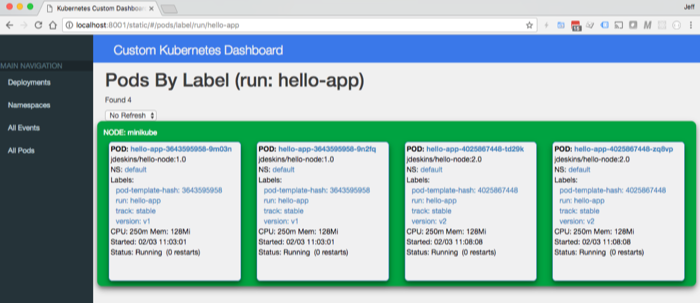

# k8s-custom-dashboard


## Run Custom Kubernetes Dashboard Locally



This will create the necessary html and javascript files 
to run the dashboard from your local machine.
The kubectl proxy command will start an internal server using the static dashboard files.

Clone this repo:
```
git clone https://github.com/jdeskins/k8s-custom-dashboard.git
cd k8s-custom-dashboard
```

Build the javascript files.
```
npm install
npm run build
``` 

Create the proxy to Kubernetes API.
```
kubectl proxy --www=.
```

Open browser to <http://localhost:8001/static/> to see the custom dashboard.
The default port is 8001. 


## Proxy Kubernetes API Server
Running the kubectl proxy command will run a proxy to the Kubernetes API server using
the credentials in ~/.kube/config file.

To use other credentials, set the Environment variable pointing to the credentials yaml file.
```
export KUBECONFIG=/path-to-config/kube.yaml
```

Now when running `kubectl` commands, it will use the credentials in the file provided in Environment variable.
